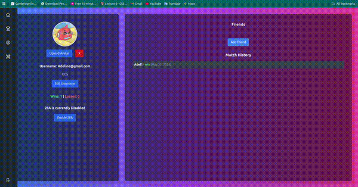
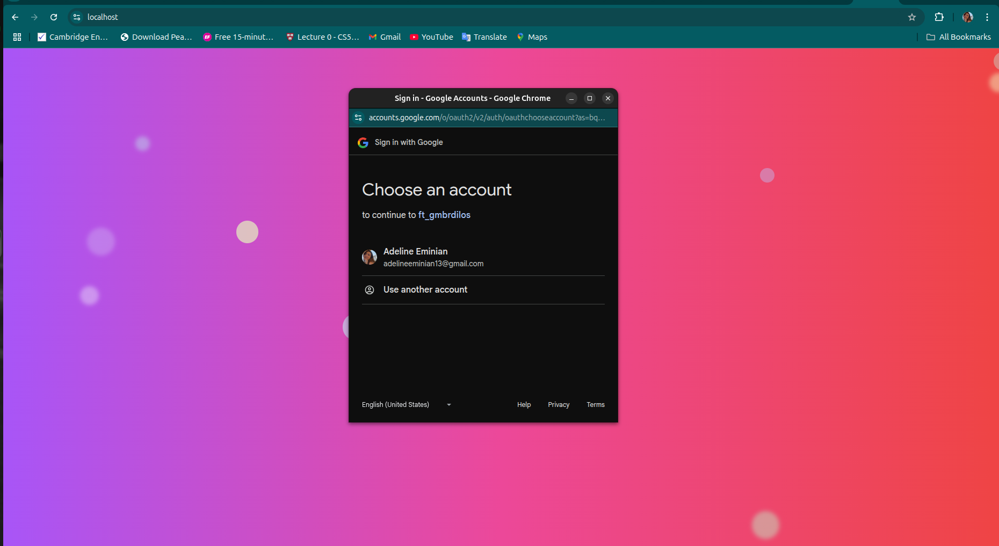
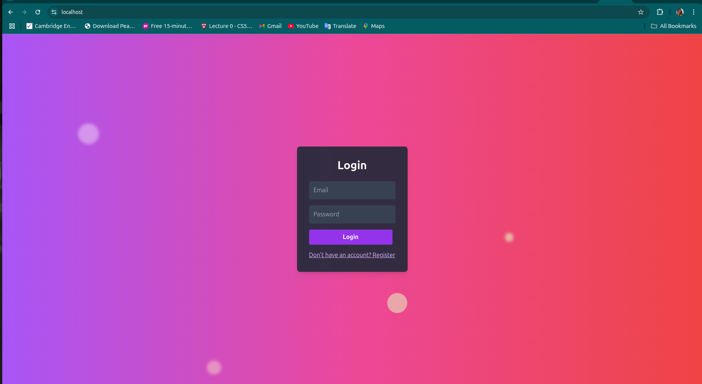
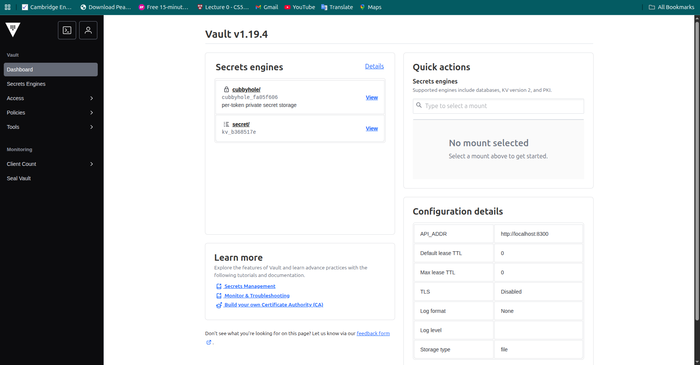
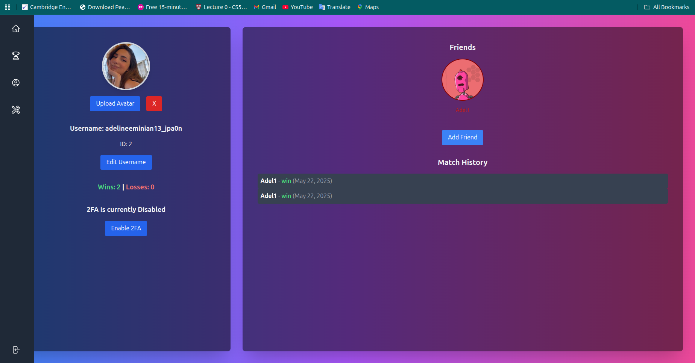
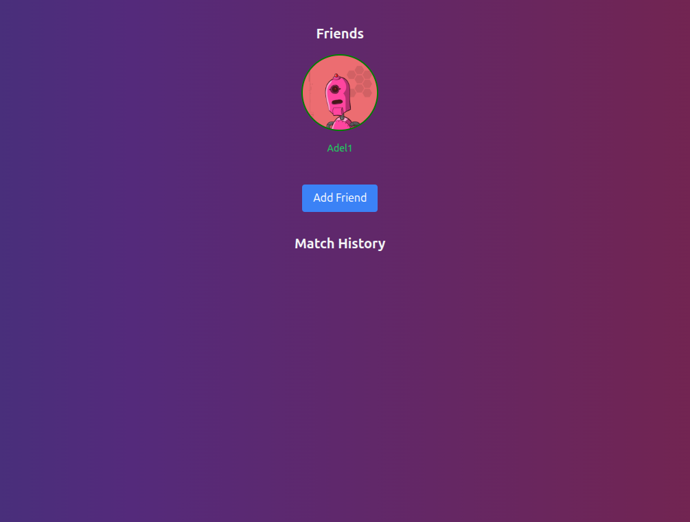

## 📖 ft\_transcendence

A web-based real-time multiplayer **Pong** game, built as part of the **42 School Common Core curriculum**. This project challenged us to explore unfamiliar technologies, develop real-time web applications, and integrate various gameplay, user management, and security features — all containerized via Docker.

---

## 📊 Badges


---

## 🎥 Demo



---

## 📌 Table of Contents

* [About the Project](#about-the-project)
* [Features](#features)
* [Technologies Used](#technologies-used)
* [Setup & Installation](#setup--installation)
* [Project Structure](#project-structure)
* [Modules Implemented](#modules-implemented)
* [Security Measures](#security-measures)
* [Contributors](#contributors)

---

## 🎮 About the Project

**ft\_transcendence** is a real-time, multiplayer Pong tournament platform with:

* A clean, responsive, single-page interface
* Real-time gameplay with matchmaking and tournaments
* Secure authentication and user management
* Integrated live chat and player profiles
* Dockerized deployment for portability and ease of use

The project required mastering web technologies under constraints, focusing on problem-solving and adaptability rather than relying on familiar stacks.

---

## 🚀 Features

* Real-time **1v1 Pong gameplay**
* **Tournament system** with alias-based matchmaking
* **User registration/login**, profile customization, and stats tracking
* **Match history**
* **Game customization options**
* **Remote multiplayer support**
* **Responsive SPA** built with TypeScript and Tailwind CSS
* Fully containerized with **Docker**
* Secure, validated user inputs and HTTPS connections

---

## 🛠️ Technologies Used

* **Backend:** Node.js (Fastify)
* **Frontend:** TypeScript, Tailwind CSS, Babylon.js (for future 3D)
* **Database:** SQLite
* **Authentication:** JWT, 2FA (where applicable)
* **Containerization:** Docker
* **Security:** Hashicorp, ModSecurity
---

## ⚙️ Setup & Installation

1. **Clone the repository**

   ```bash
   git clone https://github.com/Adel2k/ft_transendence.git
   cd ft_transendence
   ```

2. **Configure environment variables**

   Copy `.env.example` to `.env` and update accordingly.

3. **Build and run containers**

   ```bash
   make
   ```

4. Access the application at `http://localhost`

---

## 📂 Project Structure

```
ft_transcendence/
├── backend/              # Fastify server, APIs, DB models
    └── database/         # SQLite DB and migrations
├── frontend/             # TypeScript + Tailwind SPA
├── docker-compose.yml    # Service orchestration
├── Makefile
├── Dockerfile            # App container
├── vault                 # Secret Manager hashicorp
├── .env                  # Environment variables
└── README.md
```

---

## 🎯 Modules Implemented

✅ **Mandatory part**

* Real-time Pong game
* Tournament matchmaking
* SPA architecture
* Dockerized deployment

✅ **Major Modules**

* Fastify-based Backend
* User Management (signup/login/profile/avatar/friends)
* Remote Multiplayer
* 2FA + JWT Security

✅ **Minor Modules**

* Tailwind CSS for frontend
* SQLite database
* Game customization options
* Stats dashboards
* Accessibility improvements
* Multi-browser support
* Device responsiveness

---

## 🔐 Security Measures

Security was a top priority in the development of **ft\_transcendence**. The following mechanisms were implemented to safeguard user data, communication, and system integrity:

* **Password hashing** using **bcrypt**
* **Input validation and sanitization** to protect against:

  * SQL Injection (SQLi)
  * Cross-Site Scripting (XSS)
* **HTTPS enforced** across all communications (wss for WebSocket connections)
* **Google Sign-In OAuth 2.0 integration** for secure, streamlined authentication:

  * Users can log in with their Google account credentials via OAuth
  * Access tokens and user profile data handled securely following OAuth best practices
  * Safe token exchange and session handling



* **JWT-based authentication** with optional **Two-Factor Authentication (2FA)** for enhanced user security



* **Environment variables and secrets** are securely stored using **HashiCorp Vault**:

  * API keys, database credentials, and other sensitive data are encrypted and isolated from the codebase
  * Centralized secret management minimizes exposure and simplifies access control



* **Web Application Firewall (WAF)** powered by **ModSecurity**:

  * Hardened configuration to detect and block malicious traffic, such as:

    * Common web attacks (XSS, SQLi, CSRF)
    * Rate limiting for abuse prevention
    * Custom security rules for sensitive routes and APIs
* **Secure token handling** and **session management** with automatic token expiration and invalidation
* **Docker container isolation** and **network restrictions** to minimize attack surface

---

## 📊 WebSocket User Status Management Diagram

Here’s an ASCII-style diagram you can include:

```
                        +--------------------+
                        |    Web Application   |
                        |  (Frontend SPA)      |
                        +----------+-----------+
                                   |
                                   |  WebSocket (wss)
                                   |
                        +----------v-----------+
                        |    Socket Server     |
                        | (Fastify + Socket.io)|
                        +----------+-----------+
                                   |
           +-----------------------+----------------------+
           |                       |                      |
  +--------v-------+       +-------v--------+      +-------v-------+
  |  User A (Online)|       |  User B (Offline)|    |  User C (Online)|
  +----------------+       +-----------------+    +----------------+
          |                          |                     |
          +-----[online status]------+                     |
          |                                                |
          +------------------------------[friend list updates]

    (When a socket connects, user is marked 'Online' in DB or in-memory)
    (When disconnects, server updates to 'Offline' and broadcasts updates)
```

---

## 📌 Diagram Summary:

* **Web app SPA connects via secure WebSocket (`wss://`)**
* **Server tracks active sockets and marks users online/offline**
* **On connect/disconnect:**

  * Status is updated in DB (or memory)
  * Friends get live status updates via socket events
Great call — let’s succinctly describe that too! Here’s a clean, one-liner you can slot into your **Features** and **Notable Features** sections:

* **Match history tracking** — each user can view a personal log of their past games, opponents, scores, and match dates.




* **Random unique avatars** auto-assigned to new users at signup



* **Front-end displays real-time online/offline badges on friends list**

---


## 👥 Contributors

* [Adeline Eminian](https://github.com/Adel2k)
* [Narek Tamazyan](https://github.com/natamazy)
* [Narek Karapetyan](https://github.com/nkarapet42)


---

## 📃 License

This project is part of the **42 School curriculum** and follows its internal project regulations.
